Mini Estação de Tratamento Água
------------------
### Descrição do projeto: 
O projeto consiste em uma mini Estação de tratamento de água(ETA), escolhemos esta temática para entender melhor o funcionamento de uma ETA real.

### Lista de materiais: 
- Fúsivel de 3A.
- Capacitor eletrolítico 470uF/16V.
- Resistor de 47k ohms.
- 2 Resistores de 1k ohms.
- 2 Resistores de 220 ohms.
- 3 Resistores de 470 ohms.
- 3 Resistores de 4.7k ohms.
- 3 Resistores de 2.2k ohms.
- 2 diodos 1N4007.
- 2 opto-acopladores PC817.
- 2 transístores BC337 NPN TO92.
- 1 LED verde.
- 5 Borneiras de 3 vias.
- 3 Borneiras de 2 vias.
- 1 Chave switch liga/desliga.
- 1 Conector jack 4.
- Conversor DC/DC 5V.
- Conversor DC/DC 3.3V.
- 2 Relés de 5V.
- 2 Sensores de turbidez com placa decodificadora.
- 1 Sensor de pH com placa decodifcadora.
- 1 ESP32 WROOM.
- 1 Fonte 12V 2A.
- 1 Placa de fenolite.

### Montagem:
Fotos :

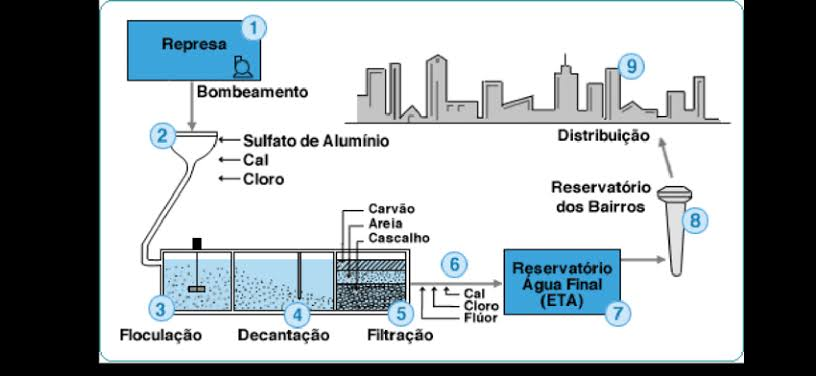

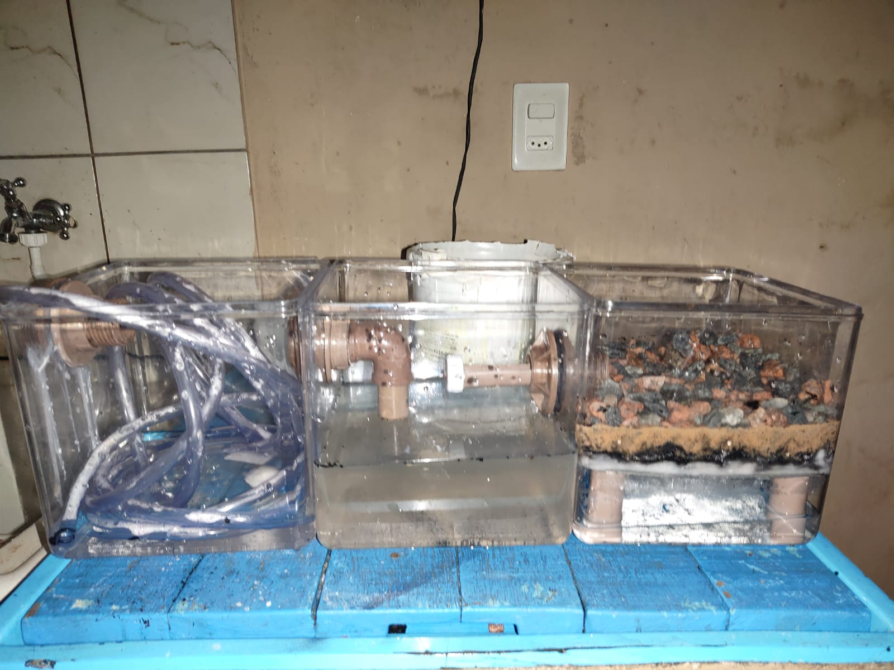

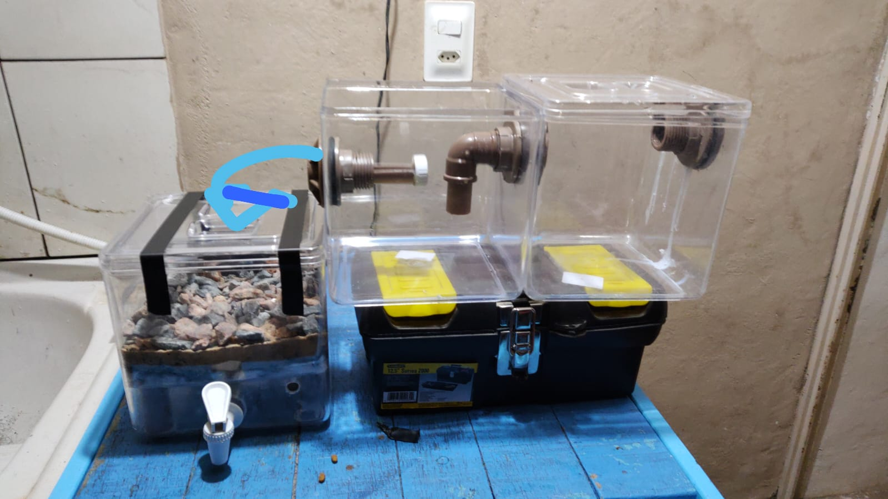

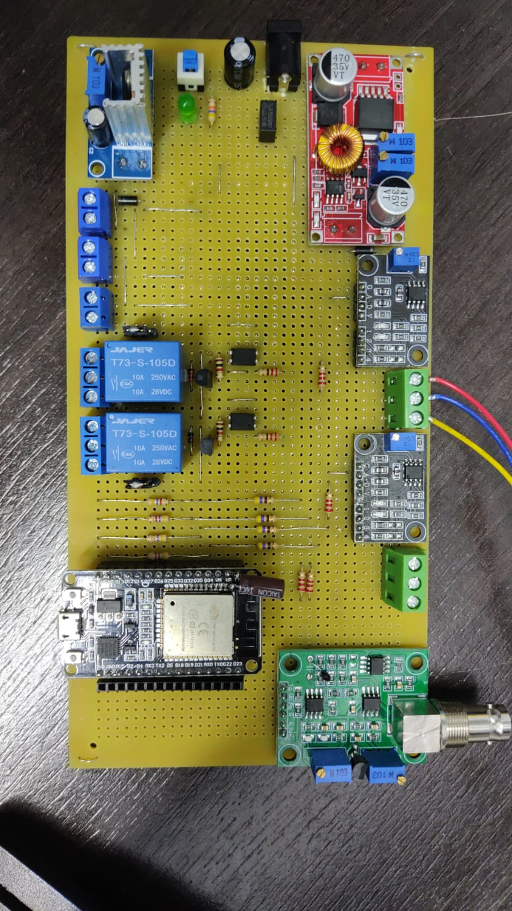

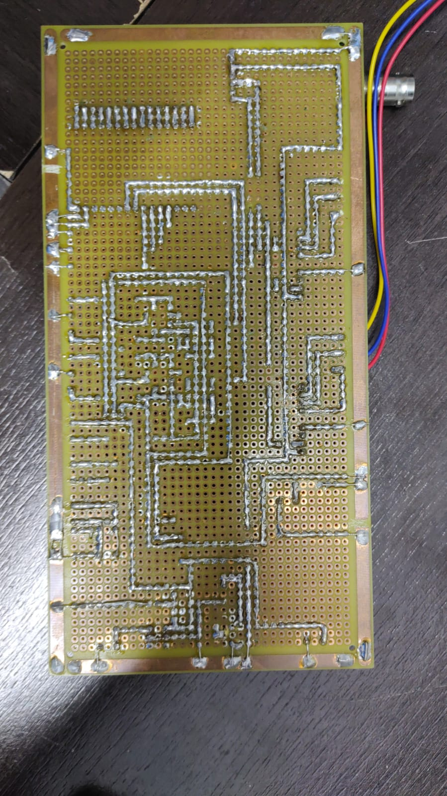

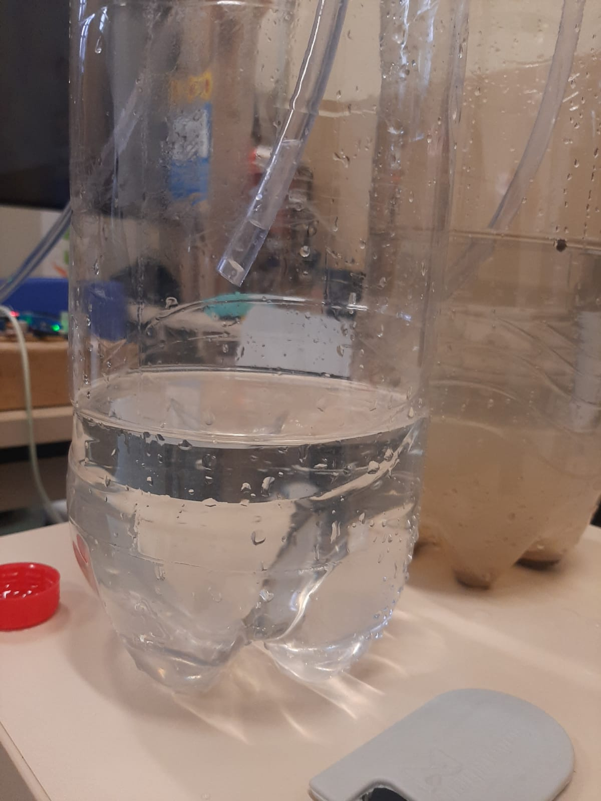

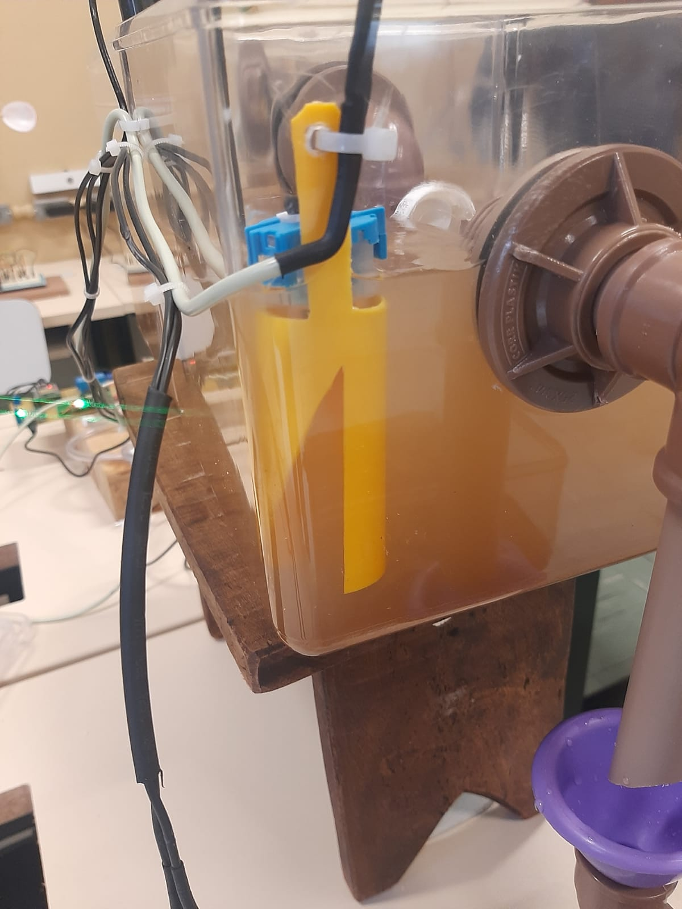

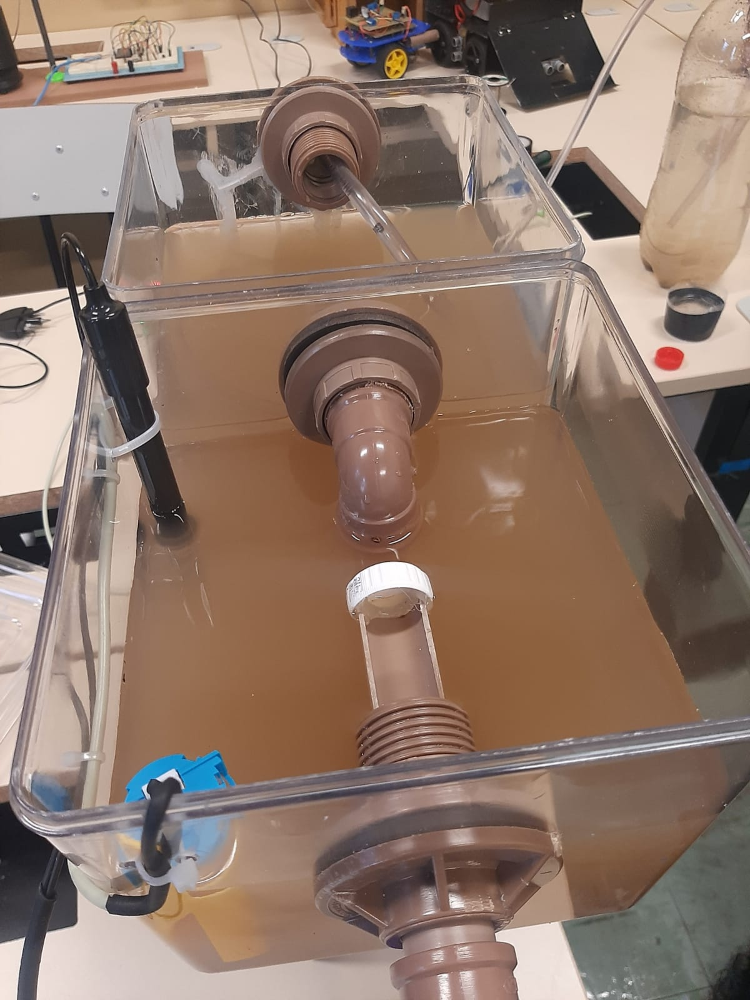

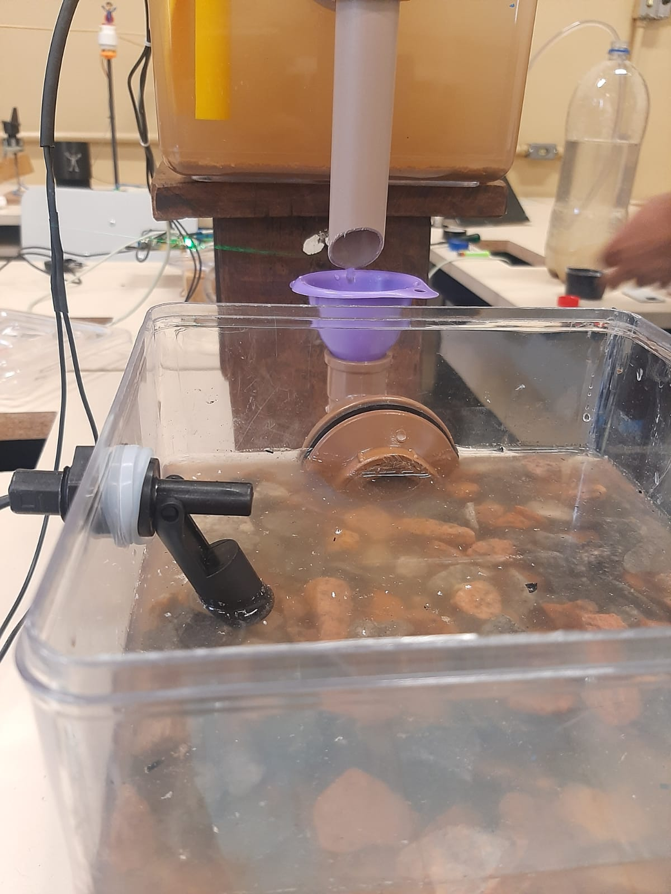

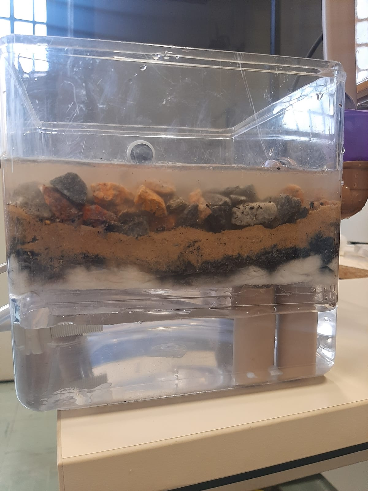

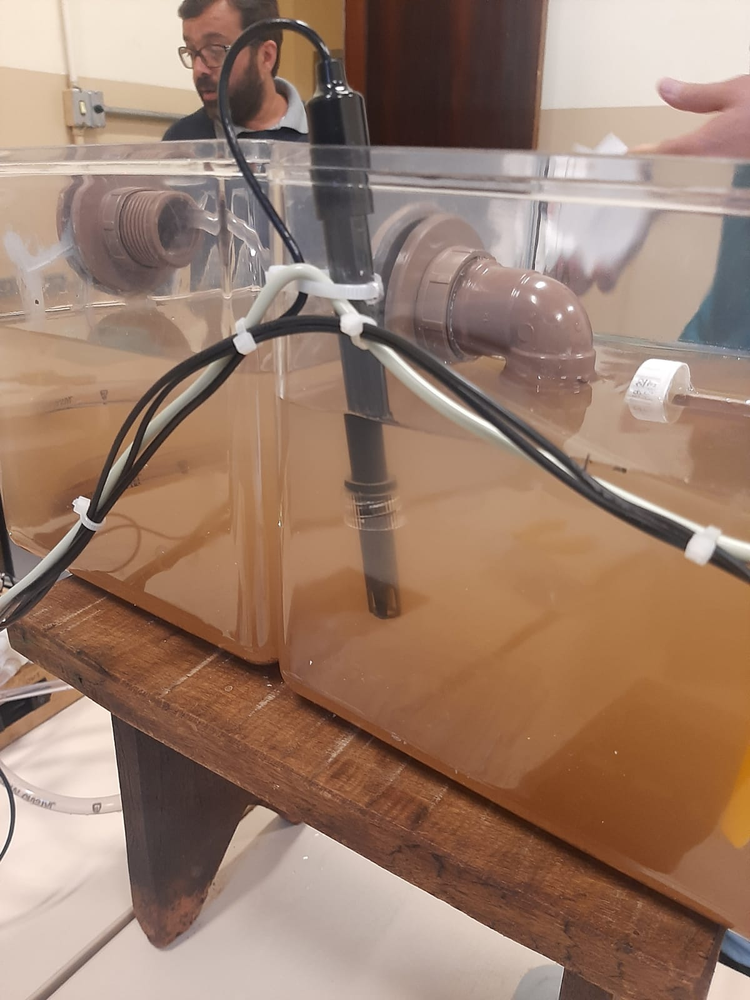

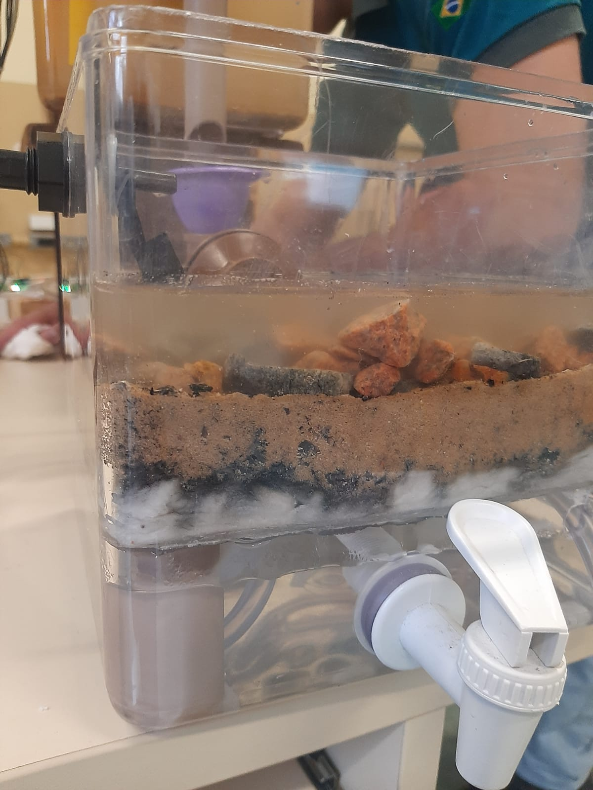

### Código-fonte:
([Clique aqui](https://github.com/jonas4040/EstacaoTratamentoAgua/blob/main/src/EstacaoTratamentoAgua/EstacaoTratamentoAgua.ino)) .

### Resultados: 
A parte que deu mais trabalho foi a montagem do circuito na placa de fenolite e a montagem e junção dos recipientes de acrílico. Obtivemos um resultado satisfatório na medição da turbidez e do pH da água.
